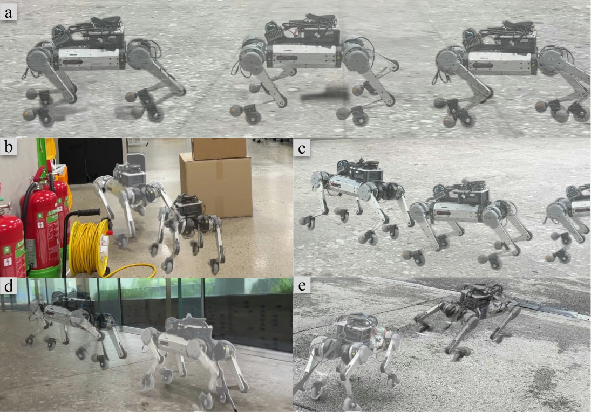

# SkateNav

### Learning Unified Adaptive Skating and Local Navigation for Passive-Wheel Quadrupedal Robots

**▶ [Project page with videos → ktw1404.github.io/SkateNav](https://ktw1404.github.io/SkateNav/)**

Author One, Author Two, Author Three, Hyun Myung — Urban Robotics Lab, KAIST

<!-- TODO: real author names and venue -->



---

Quadrupedal robots traverse rough and discontinuous terrain, yet each impact with the ground
dissipates energy and limits how far they can travel. A passive-wheel quadruped can build
momentum with leg pushes and glide on the wheels in between, covering distance without
further pushing.

Existing locomotion controllers take a commanded velocity as input, and navigation is left to
an external planner. How long to push and how long to glide depends on where the robot must
arrive and by when. A controller given only a velocity cannot make that decision.

We present **SkateNav**, a single policy that decides steering, propulsion, and their timing
together. It is given a target location and the time remaining rather than a velocity, and it
sets the pace of its own push–glide cycle as conditions change. In simulation, SkateNav
reaches its goals more reliably and at a lower energy cost than a planner paired with a
velocity-tracking controller. The same policy runs on the physical robot without further
tuning, over indoor and outdoor terrain.

## Results

|  | SR ↑ | CoT ↓ | IT [ms] |
|---|---|---|---|
| **Ours** | **93.3** | **0.559** | **0.28** |
| ↳ w/o Adaptive Freq. | 84.0 | 0.581 | — |
| ↳ w/o Skating Cycle | 58.5 | 0.894\* | — |
| DWA+VT | 85.2 | 0.667 | — |
| MPPI+VT | 84.5 | 0.659 | 1.31 |
| CEM+VT | 83.1 | 0.626 | 2.48 |

Averaged over five evaluation conditions (*Flat*, *BARN-easy*, *BARN-hard*, *Uphill*,
*Downhill*), 1000 navigation tasks each. \**Uphill* is excluded from the average CoT, since
*w/o Skating Cycle* completes no trial there. Per-environment numbers are on the
[project page](https://ktw1404.github.io/SkateNav/#results).

## Videos

Deployment clips from the physical robot across indoor and outdoor sites, plus a simulation
rollout, are in the
[Real-World section of the project page](https://ktw1404.github.io/SkateNav/#realworld).

## Links

- Paper — *coming soon*
- arXiv — *coming soon*
- Code — *coming soon*

## Citation

```bibtex
@inproceedings{skatenav,
  title     = {{SkateNav}: Learning Unified Adaptive Skating and Local Navigation
               for Passive-Wheel Quadrupedal Robots},
  author    = {Author, One and Author, Two and Author, Three and Myung, Hyun},
  booktitle = {TBD},
  year      = {TBD}
}
```

---

This repository *is* the project page: it holds the static site served by GitHub Pages.
See [DEVELOPING.md](DEVELOPING.md) for how the page is built and published.
